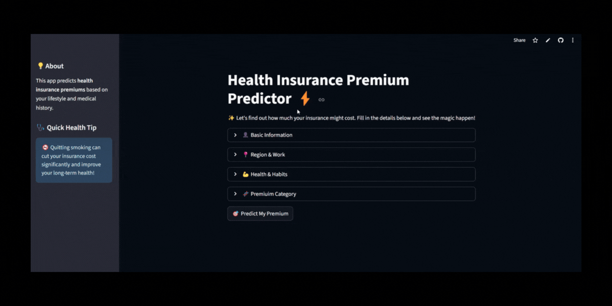
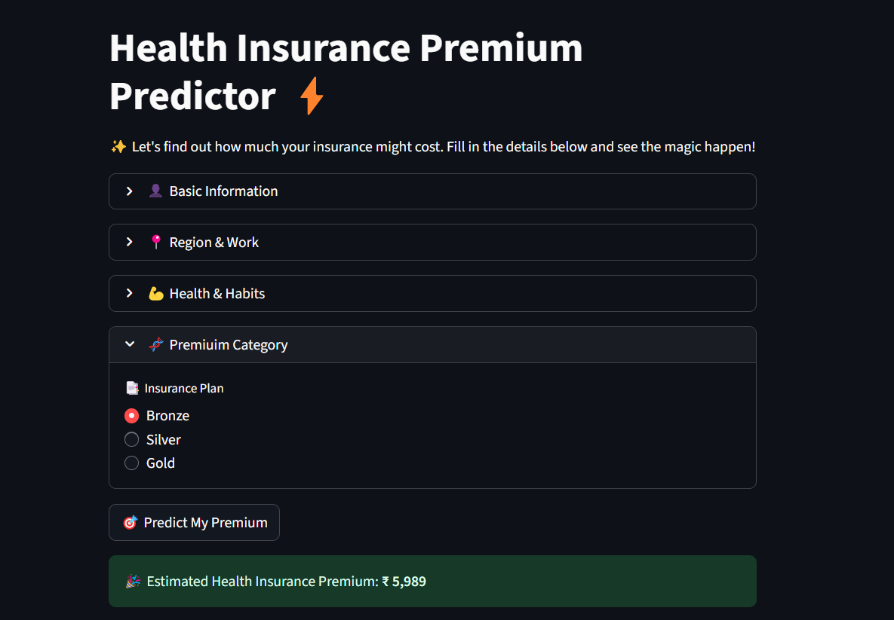

<div align="center">
  


<h1 align="center"> Health Insurance Premium Predictor 💸 </h1>

[](https://premium-predictor-app.streamlit.app/)

</div>

<p align="center">
  <a href="#installation">Installation</a> •
  <a href="#features">Features</a> •
  <a href="#app-overview-&-usage">App Overview & Usage</a> •
  <a href="#live-demo">Live Demo</a> •
  <a href="#acknowledgements">Acknowledgements</a> •
  <a href="#license">License</a>
</p>

The **Health Insurance Premium Predictor** is a machine learning–powered web app that estimates personalized insurance costs based on factors such as age, income, BMI, smoking habits, and medical history.  

Designed with transparency in mind, the app not only predicts premiums but also helps users understand which lifestyle and health choices contribute most to their costs. Built using **Streamlit**, **Scikit-learn**, and **XGBoost**, it demonstrates the end-to-end process of solving a real-world problem — from data preprocessing and model development to deployment with an interactive user interface.  

An interactive **Streamlit web app** that predicts health insurance premiums based on your age, lifestyle, medical history, and coverage plan.  
Built with **machine learning models** trained on synthetic insurance data.

## ❗ Problem Statement  
Health insurance premiums vary widely based on factors such as age, lifestyle, and medical history, making them difficult for individuals to estimate and understand.  
This lack of transparency often leads to confusion, poor decision-making, and mistrust in the system.  
The challenge is to build a predictive solution that not only estimates premiums accurately but also helps users understand which factors drive their costs.  

## 💡 Solution Statement  
This project provides a machine learning–powered app that predicts health insurance premiums based on user-specific factors such as age, BMI, smoking status, and medical history.  
By combining tailored preprocessing with Linear Regression (for younger users) and XGBoost (for older users), the app delivers accurate, personalized estimates while offering a transparent view of how lifestyle and health choices impact premium costs.  

## ✨ Features <a name="features"></a>

- 🧑‍⚕️ Predicts **personalized premium costs** in seconds
- 📊 Considers multiple factors:
  - Age, gender, marital status, number of dependants  
  - Income level and employment type  
  - Region of residence  
  - Genetic risk, BMI category, smoking status  
  - Medical history (diabetes, hypertension, thyroid, heart disease, etc.)  
  - Insurance plan type (Bronze, Silver, Gold)  
- ⚡Switch between different scenarios instantly to compare outcomes.  
- 🎉 Fun, clean, and user-friendly interface powered by **Streamlit**.


## 🖥️ App Overview & Usage <a name="app-overview-&-usage"></a>

The app is divided into **4 expandable sections** for user inputs:

1. **👤 Basic Information**  
   - Age  
   - Gender  
   - Marital Status  
   - Number of Dependants  

2. **📍 Region & Work**  
   - Region  
   - Employment Status  
   - Yearly Income (in Lakhs)  

3. **💪 Health & Habits**  
   - Genetic Risk (0–5 scale)  
   - BMI Category  
   - Smoking Status  
   - Medical History  

4. **🧬 Premium Category**  
   - Insurance Plan (Bronze, Silver, Gold)  

The app preprocesses user's input data by selecting the correct scaler and the features are then passed to the appropriate model based on user's age:  

- **Age ≤ 25** → Uses [scaler_young.joblib](./artifacts/scaler_young.joblib) and [model_young.joblib](./artifacts/model_young.joblib) (**Linear Regression**)  
- **Age > 25** → Uses [scaler_rest.joblib](./artifacts/scaler_rest.joblib) and [model_rest.joblib](./artifacts/model_rest.joblib) (**XGBoost Regressor**)  

This segmentation ensures that younger applicants and older applicants are modeled appropriately, improving prediction accuracy.

---


### 📊 Example Prediction


#### ✅ Example 1: Healthy Baseline Profile
**Inputs:**
- Age: 24  
- Gender: Female  
- Marital Status: Unmarried  
- Dependants: 0  
- Region: Northwest  
- Employment: Freelancer  
- Income: ₹ 6 Lakhs  
- Genetic Risk: 0  
- BMI: Normal  
- Smoking: Non-Smoker  
- Medical History: No Disease  
- Insurance Plan: Bronze  

**Result:**  
🎉 Estimated Health Insurance Premium: **₹ 5,989** (example)  

> 💡 With no medical risks, no smoking habit, and a Bronze plan, the premium is at the lower end.

---

#### 🔥 Example 2: High-Risk Profile
**Inputs:**
- Age: 35  
- Gender: Male  
- Marital Status: Married  
- Dependants: 2  
- Region: Southeast  
- Employment: Salaried  
- Income: ₹ 12 Lakhs  
- Genetic Risk: 2  
- BMI: Overweight  
- Smoking: Regular  
- Medical History: Diabetes & High Blood Pressure  
- Insurance Plan: Gold  

**Result:**  
🎉 Estimated Health Insurance Premium: **₹ 28,870** (example)  

> 💡 Notice how risk factors (smoking + medical history + Gold plan) significantly increase the premium compared to the baseline healthy profile.


## 🌐 Live Demo <a name="live-demo"></a>

👉 Try the app here: **[Health Insurance Premium Predictor](https://premium-predictor-app.streamlit.app/)**


## 🛠️ Tech Stack

- **Streamlit** for the web app UI  
- **scikit-learn** for ML modeling  
- **Pandas** for data preprocessing  
- **Joblib** for model serialization  


## 📦 Project Structure

```bash
Health_Insurance_Premium_Predictor/
│
├── assets/                         
│   ├── demo.gif                    # Demo of the Streamlit web app
│   ├── screenshot.png              # Screenshot of Streamlit web app
│
├── artifacts/                      # Serialized models and scalers
│   ├── model_rest.joblib           # XGBoost Model for users > 25 years (adult users)
│   ├── model_young.joblib          # Linear Regression Model for users <= 25 years (younger users)
│   ├── scaler_rest.joblib          # StandardScaler for older group
│   └── scaler_young.joblib         # StandardScaler for younger group
│
├── LICENSE                         # Apache License file
├── README.md                       # Project documentation
├── main.py                         # Streamlit app logic
├── prediction_helper.py            # Preprocessing & prediction logic
└── requirements.txt                # Python dependencies
```


## 🚀 Installation <a name="installation"></a>

### Prerequisites:  
- Python 3.10+

1. **Clone the repository**:
   ```bash
   git clone https://github.com/sashfaq911/health-insurance-premium-predictor.git
   cd health-insurance-premium-predictor
   ```
2. **Install dependencies**:   
   ```commandline
    pip install -r requirements.txt
   ```
5. **Run the Streamlit app**:   
   ```commandline
    streamlit run main.py
   ```

## 🙏 Acknowledgements <a name="acknowledgements"></a>

A special thanks to [Dhaval Patel](https://www.linkedin.com/in/dhavalsays/) and [Hemanand Vadivel](https://www.linkedin.com/in/hemvad/) for their guidance through the [CodeBasics Gen AI & Data Science BootCamp](https://codebasics.io/bootcamps/dashboard/ai-data-science-bootcamp-with-virtual-internship). This project has been an invaluable learning experience and a key milestone in my data science journey!


## 📄 License <a name="license"></a>

This project is licensed under the **Apache License 2.0**. See the [LICENSE](./LICENSE) file for details.


## ❤️  Support

Contributions, issues, and suggestions are welcome!

Give a ⭐️ if you like this project!
